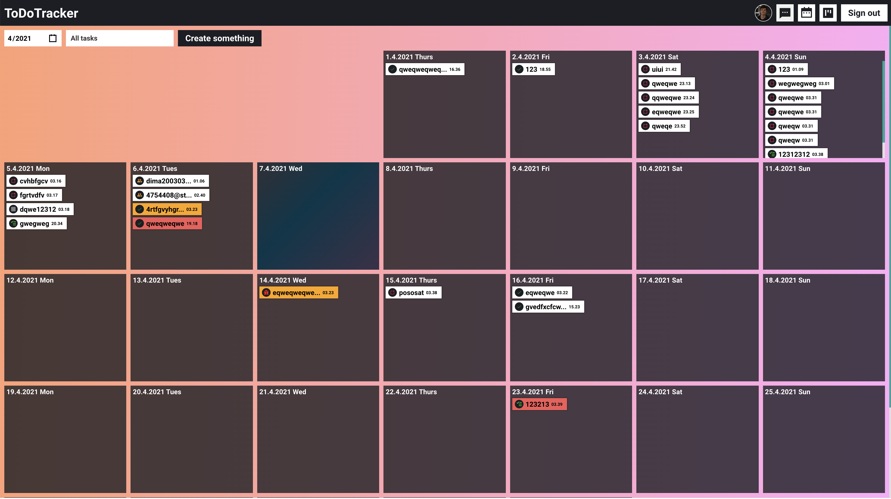
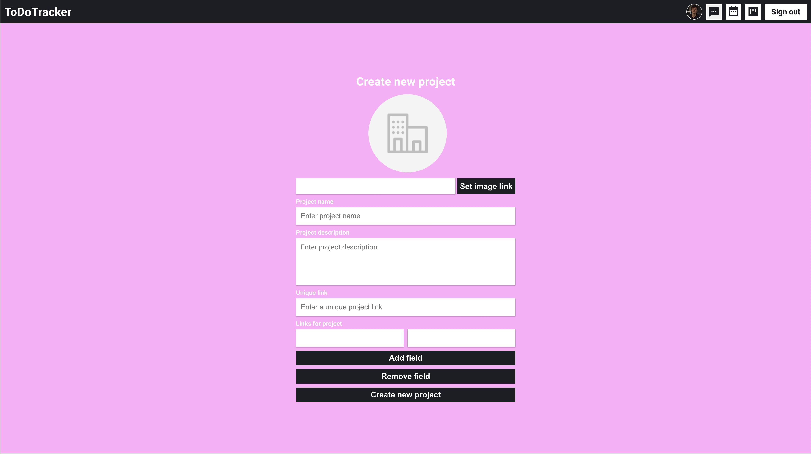
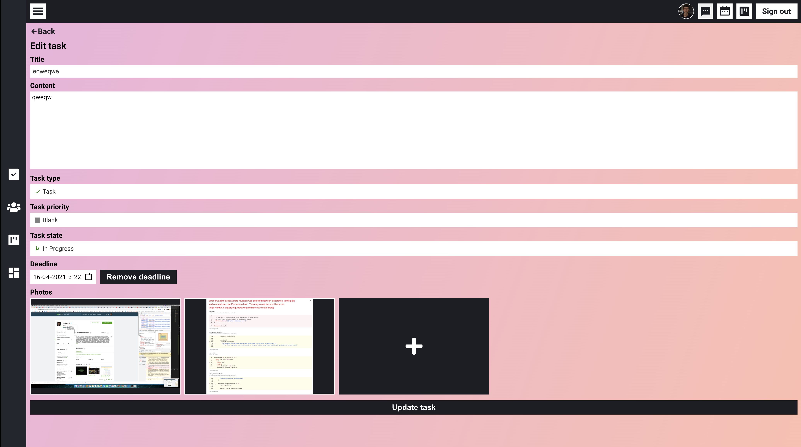
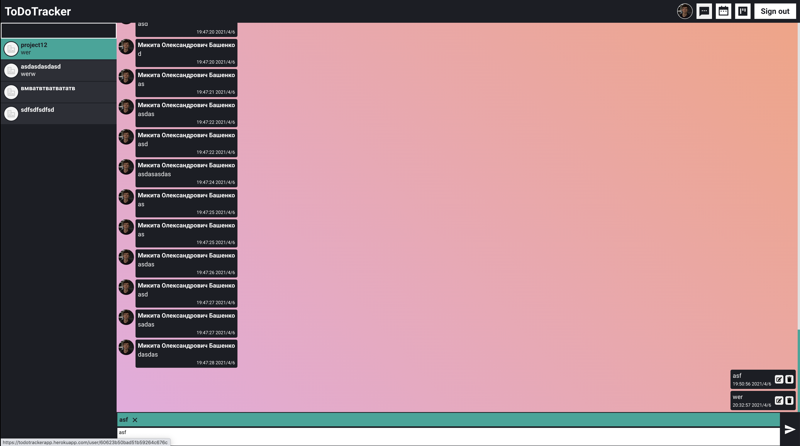
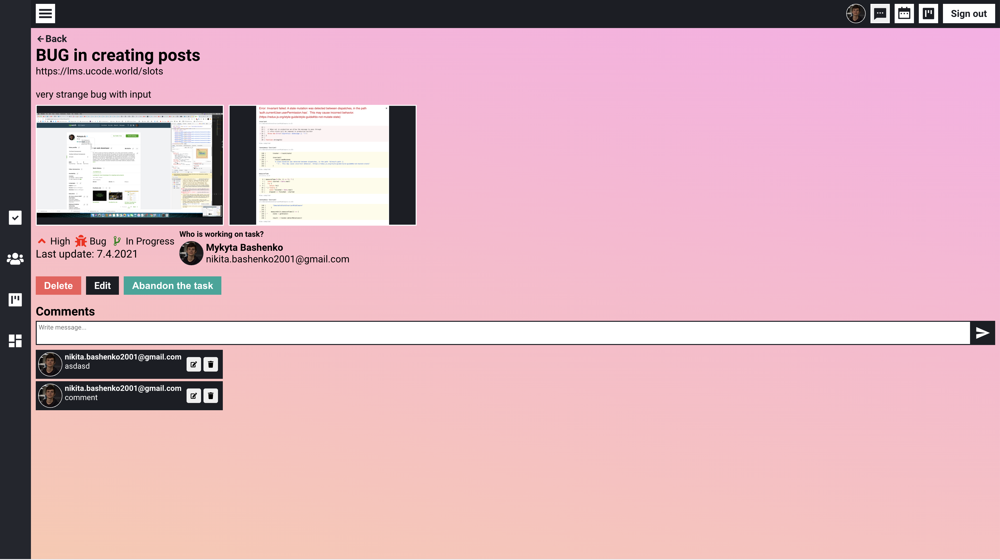
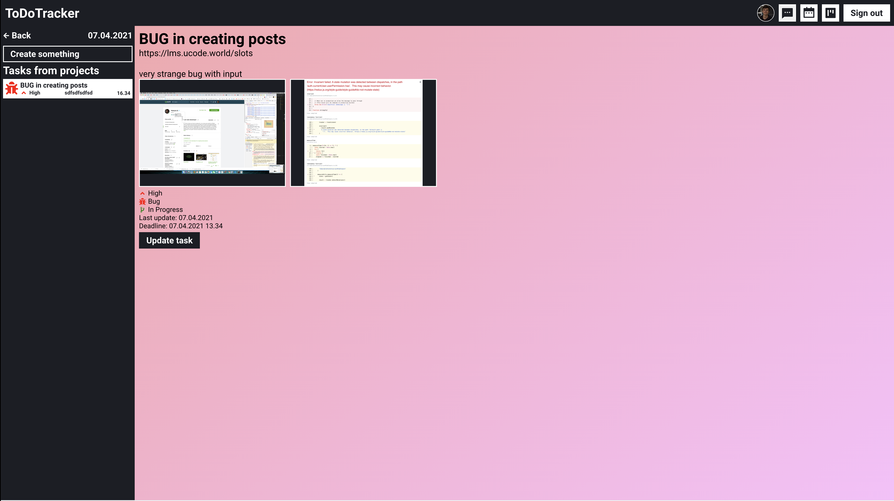
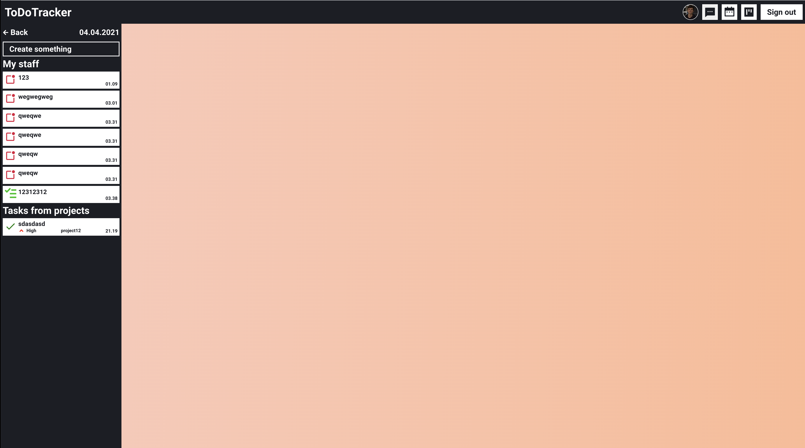
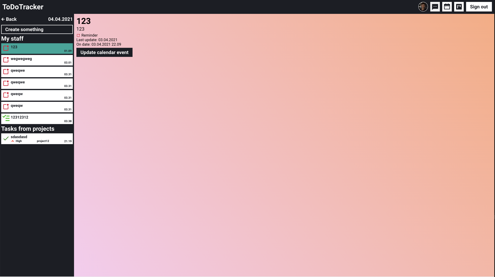
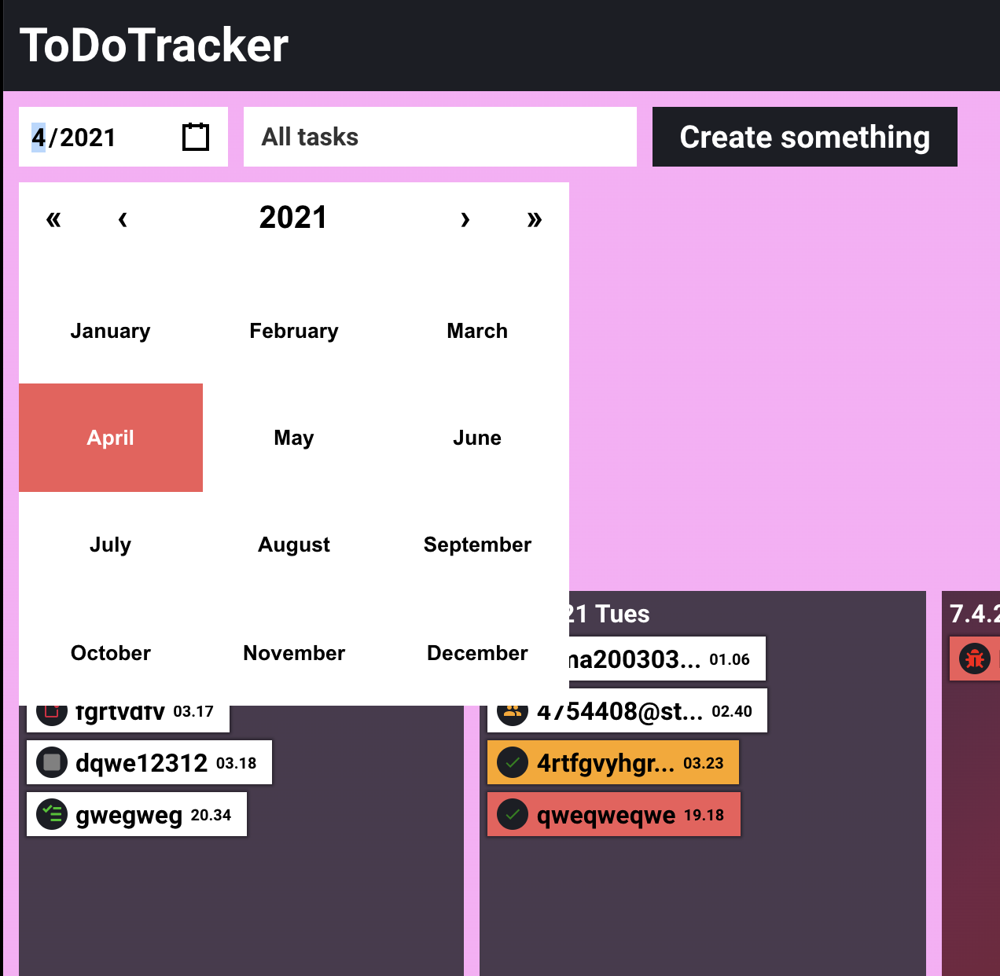
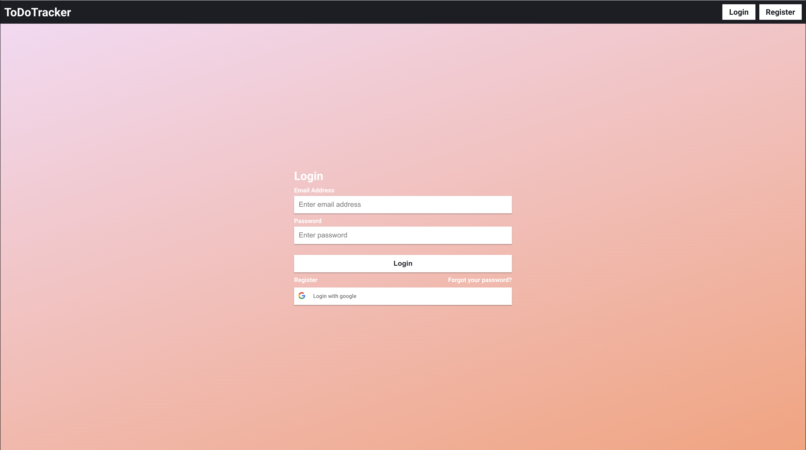

# BugTracker/Chat/Calendar

### Technology stack

##### 1. React

##### 2. Redux

##### 3. Node

##### 4. Mongo

##### 5. Express

##### 6. Socket.io


#### Live [https://todotrackerapp.herokuapp.com/](https://todotrackerapp.herokuapp.com/)

```python
### env
ACCESS_TOKEN_SECRET=secret1

ACTIVATION_TOKEN_SECRET=secret1

CLIENT_URL=https://todotrackerapp.herokuapp.com

MAIL_ADDRESS=

MAIL_PASSWORD=

MONGODB_URL=.....mongodb.net/todotracker?retryWrites=true&w=majority

REACT_APP_GOOGLE_CLIENT=code_for_btn

REACT_APP_SOCKET_SERVER_URL=https://todotrackerapp.herokuapp.com

REFRESH_TOKEN_SECRET=secret3

```

# Some images













